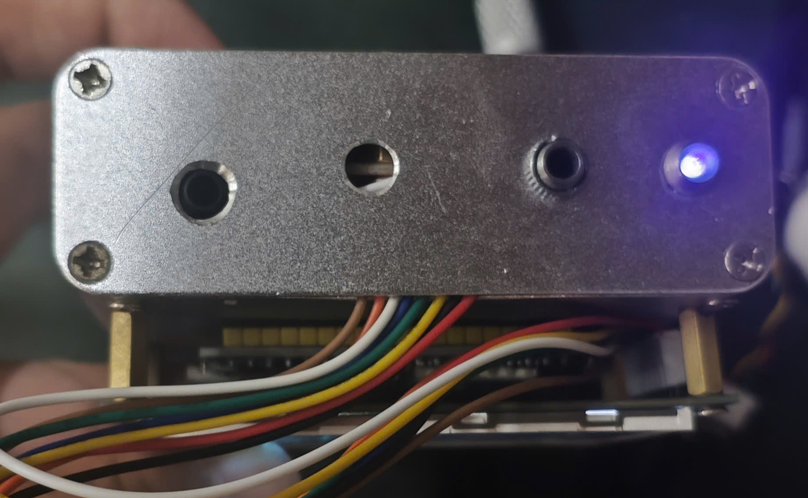
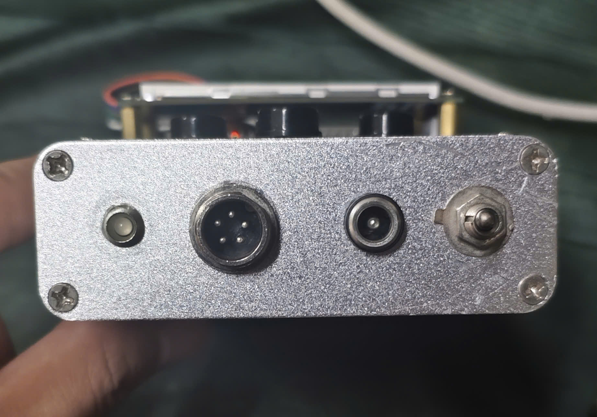
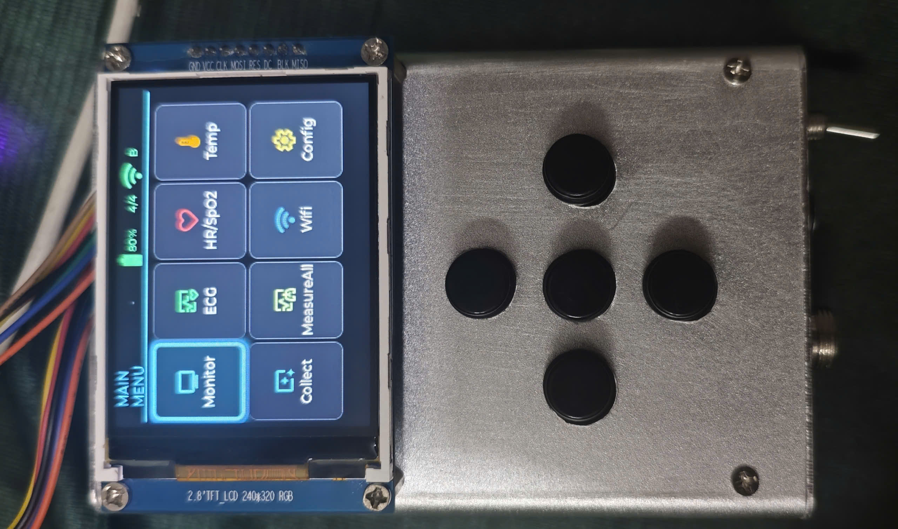
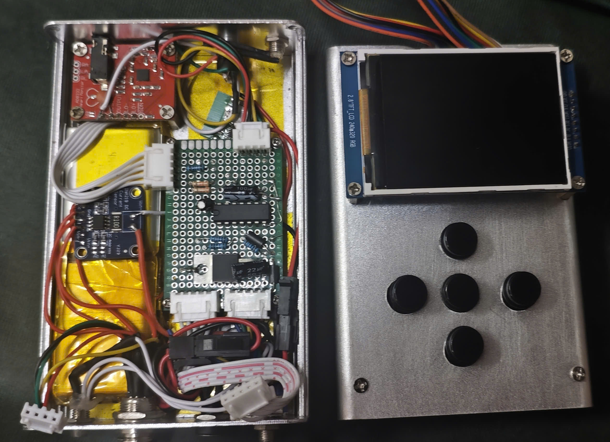
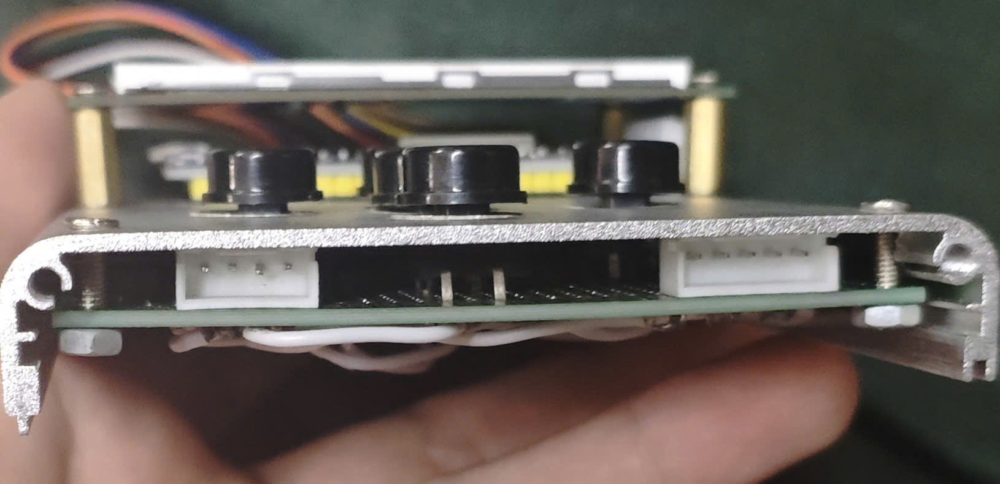
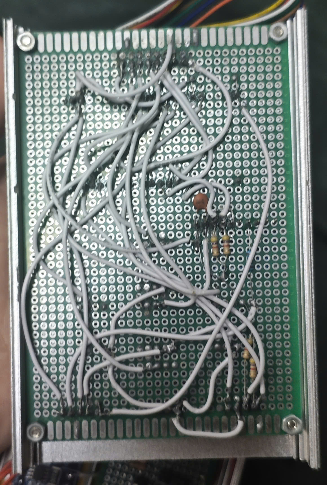

# ESP32 Medical IoT

<p align="center">
  
  
  
  
</p>

Firmware PlatformIO cho hệ thống giám sát sức khỏe dùng ESP32. Thiết bị kết hợp ECG, HR/SpO2, nhiệt độ hồng ngoại, giao diện LCD 320x240, WiFi/MQTT và các luồng test cảm biến riêng lẻ.

> Dự án phục vụ mục đích nghiên cứu và phát triển.

## Điểm nổi bật

| Icon | Nhóm | Nội dung |
| --- | --- | --- |
| 🫀 | ECG | Đọc tín hiệu AD8232 qua ADS1115 16-bit, lọc nhiễu nhiều tầng, notch 50 Hz, phát hiện lead-off và tính BPM realtime. |
| 📊 | Giao diện | UI LCD 320x240 dùng LVGL + TFT_eSPI, có biểu đồ ECG liên tục và nhiều màn hình trạng thái. |
| 🌡️ | Cảm biến | MAX30102/MAX3010x cho HR/SpO2, MLX90614 cho nhiệt độ không tiếp xúc, VL53L0X cho khoảng cách, INA219 cho nguồn/dòng. |
| 🧩 | Kiến trúc | Tách runtime cảm biến, presenter giao diện và từng flow test để dễ debug trên phần cứng thật. |
| 📡 | Kết nối | Có WiFi config manager và PubSubClient để mở rộng luồng gửi dữ liệu qua MQTT. |

## Liên kết

- Web hỗ trợ hiển thị dữ liệu/monitor: [KLTN_Web](https://github.com/buithan04-uit/KLTN_Web)

## Hình ảnh thiết bị

Ảnh được thu gọn để README không chiếm quá nhiều không gian. Mở mục bên dưới khi cần xem nhanh phần cứng.

<details>
<summary>Xem gallery thiết bị</summary>

<br>

<p>
  
  
  
  
  
  
</p>

</details>

## Tổng quan hệ thống

Dự án có ba nhóm chức năng chính:

- ECG realtime với AD8232 + ADS1115.
- HR/SpO2 với MAX30102 hoặc MAX3010x.
- Nhiệt độ không tiếp xúc với MLX90614, kết hợp đo khoảng cách bằng VL53L0X cho luồng data collector.

Firmware được chia thành nhiều PlatformIO environment. Mỗi environment chỉ build một nhóm file nguồn thông qua `build_src_filter` trong [platformio.ini](platformio.ini), vì vậy cần chọn đúng environment trong VS Code PlatformIO trước khi build, upload hoặc monitor.

## Phần cứng

| Icon | Thành phần | Vai trò | Giao tiếp / địa chỉ |
| --- | --- | --- | --- |
| ⚙️ | ESP32 DevKit | Vi điều khiển chính | GPIO, I2C, SPI |
| 🫀 | AD8232 | ECG analog front-end | Analog ra ADS1115 A0 |
| 🔢 | ADS1115 | ADC 16-bit cho ECG | I2C `0x48` - `0x4B` |
| 🩸 | MAX30102 / MAX3010x | HR/SpO2 | I2C `0x57` |
| 🌡️ | MLX90614 | Nhiệt độ không tiếp xúc | I2C `0x5A` |
| 📏 | VL53L0X | Đo khoảng cách | I2C |
| 🔋 | INA219 | Đo dòng/nguồn | I2C |
| 🖥️ | ILI9341 | LCD TFT 320x240 | SPI |

## Sơ đồ kết nối nhanh

| Nhóm | Chân kết nối |
| --- | --- |
| I2C chính | SDA `GPIO21`, SCL `GPIO22` |
| ADS1115 ECG | SDA `GPIO4`, SCL `GPIO5` |
| AD8232 | OUTPUT -> ADS1115 A0, LO+ -> `GPIO13`, LO- -> `GPIO14` |
| LCD ILI9341 | MISO `19`, MOSI `23`, SCLK `18`, CS `15`, DC `16`, RST `17` |

Lưu ý: với dây dài, I2C chính đang ưu tiên tốc độ thấp hơn để tăng ổn định. Không nên scan toàn dải `0x03` - `0x77` trên một số board vì có thể gây treo bus.

## PlatformIO environments

| Environment | Entry point | Mục đích |
| --- | --- | --- |
| `Main` | [src/main.cpp](src/main.cpp) | Luồng chính ECG + UI ECG. |
| `Lcd` | [src/lcd.cpp](src/lcd.cpp) | Dashboard LCD, nhiều màn hình, sensor runtime, WiFi/MQTT. |
| `Max30102` | [src/max30102.cpp](src/max30102.cpp) | Test HR/SpO2 riêng. |
| `Mlx90614` | [src/mlx90614.cpp](src/mlx90614.cpp) | Test nhiệt độ riêng. |
| `Main_Ad8232` | [src/main_ad8232.cpp](src/main_ad8232.cpp) | Luồng ECG tập trung AD8232/ADS1115. |
| `Collect_mlx_data` | [src/collect_mlx_data.cpp](src/collect_mlx_data.cpp) | Thu mẫu nhiệt độ/khoảng cách và gửi dữ liệu. |

## Kiến trúc firmware

| Module | File chính |
| --- | --- |
| ECG core | [src/ad8232.cpp](src/ad8232.cpp), [include/ad8232.h](include/ad8232.h) |
| ECG UI | [src/ui_ecg.cpp](src/ui_ecg.cpp), [include/ui_ecg.h](include/ui_ecg.h) |
| LCD runtime | [src/lcd_sensor_runtime.cpp](src/lcd_sensor_runtime.cpp), [include/lcd_sensor_runtime.h](include/lcd_sensor_runtime.h) |
| LCD presenter | [src/lcd_ui_presenter.cpp](src/lcd_ui_presenter.cpp), [include/lcd_ui_presenter.h](include/lcd_ui_presenter.h) |
| UI tổng quát | [src/ui.cpp](src/ui.cpp), [include/ui.h](include/ui.h) |
| Data collector UI | [src/ui_datacollector.cpp](src/ui_datacollector.cpp), [include/ui_datacollector.h](include/ui_datacollector.h) |
| WiFi config | [src/wifi_config_manager.cpp](src/wifi_config_manager.cpp), [include/wifi_config_manager.h](include/wifi_config_manager.h) |
| LVGL config | [include/lv_conf.h](include/lv_conf.h) |
| Icon LVGL | [include/custom_icons.h](include/custom_icons.h), [src/icons](src/icons) |

## Build và chạy

Ưu tiên dùng VS Code PlatformIO vì PlatformIO CLI có thể chưa nằm trong `PATH` trên máy này.

| Tác vụ | Cách chạy |
| --- | --- |
| Build | `PlatformIO: Build` |
| Upload | `PlatformIO: Upload` |
| Serial monitor | `PlatformIO: Monitor` |

Thông số chung:

- Serial monitor: `115200` baud.
- Upload speed: `921600`.
- Các environment có LCD cần `board_build.partitions = huge_app.csv`.

Nếu đã cài PlatformIO CLI:

```bash
pio run -e Main
pio run -e Main --target upload
pio device monitor --baud 115200
```

## Xử lý tín hiệu ECG

Pipeline ECG trong [src/ad8232.cpp](src/ad8232.cpp) tập trung vào độ ổn định của tín hiệu:

- Moving average filter để giảm nhiễu tần số cao.
- Median filter để loại spike ngẫu nhiên.
- High-pass filter để giảm baseline drift.
- Notch 50 Hz để giảm nhiễu điện lưới.
- R-peak detection và tính BPM realtime.
- Lead-off detection qua LO+ và LO-.

Thông số mặc định:

| Thông số | Giá trị |
| --- | --- |
| Sample rate | `250 Hz` |
| ADS1115 gain | `GAIN_ONE` |
| ADS1115 data rate | `475 SPS` |
| Địa chỉ ADS1115 | `0x48` - `0x4B` |

## LCD UI và data collector

Luồng `Lcd` dùng LVGL để hiển thị nhiều màn hình realtime, trạng thái WiFi, cảm biến và biểu đồ ECG. Phần presenter được tách riêng khỏi runtime cảm biến để giảm coupling và dễ chỉnh giao diện.

Luồng `Collect_mlx_data` kết hợp MLX90614 và VL53L0X:

- Median filter 3 mẫu cho khoảng cách.
- Bảng hiệu chuẩn nội suy cho VL53L0X.
- EMA thích nghi theo tốc độ biến động.
- Gate theo ngưỡng khoảng cách và nhiệt độ để tăng chất lượng mẫu.

## Dependencies chính

| Nhóm | Thư viện |
| --- | --- |
| UI | `lvgl/lvgl`, `bodmer/TFT_eSPI`, `Adafruit GFX Library`, `Adafruit ILI9341` |
| Cảm biến | `SparkFun MAX3010x`, `MAX30100_milan`, `Adafruit MLX90614`, `Adafruit ADS1X15`, `Adafruit VL53L0X`, `Adafruit INA219` |
| Kết nối | `PubSubClient`, `ArduinoJson` |

## Lưu ý kỹ thuật

- Trong LCD env, `TFT_eSPI tft` phải được định nghĩa trong [src/lcd.cpp](src/lcd.cpp), không chỉ khai báo `extern`.
- ECG UI nên cập nhật khoảng 8 ms và không bị gate bởi cadence UI 80 ms.
- LVGL chart ECG nên dùng SHIFT mode để waveform liên tục.
- Khi thoát màn hình cấu hình WiFi, tránh reconnect blocking; nên để reconnect trong async update loop.
- Một số tính năng mới hiện mới ở mức UI-only, chưa nối đầy đủ logic backend.
